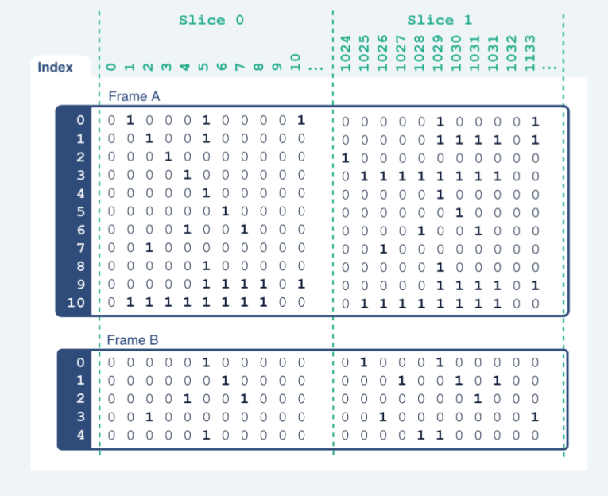
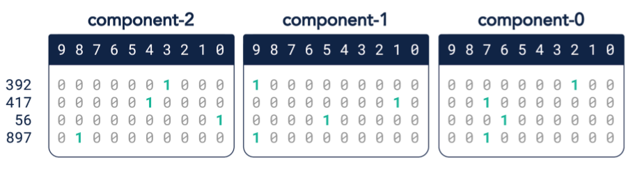
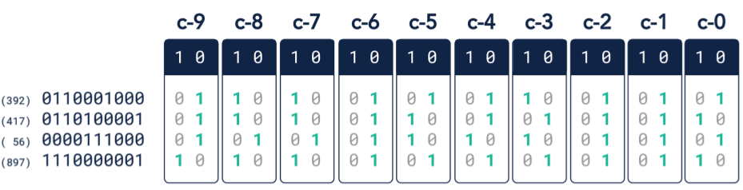
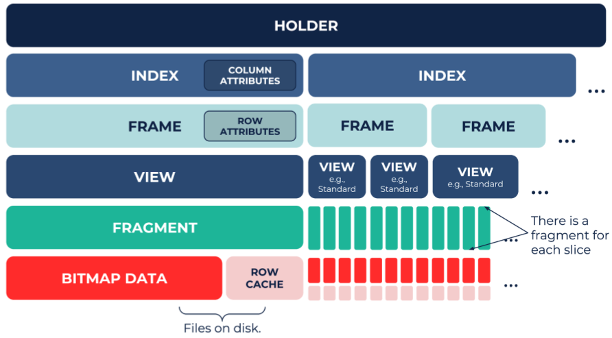

---
title: "Pilosa: A Technical Overview"
author: Pilosa Engineering Team
date: July 2018
bibliography: example.bib
abstract: 'This document will introduce you to the Pilosa distributed index.'
titlepage: true
...

# Introduction
Pilosa is a standalone index for big data. Its goal is to support real time,
complex queries without resorting to pre-computation or approximation. Pilosa
achieves this by implementing a distributed bitmap index and using it to
represent data in a variety of ways to achieve optimal performance on various
query workloads.

Pilosa is built for simplicity. Its core engine is focused entirely on the
efficient storage and manipulation of many very wide bitmaps. This spartan
kernel can be made to serve a wide variety of data types and query workloads as
we will see throughout this paper.

We'll cover data modeling, low level storage details, use cases, software
architecture, and external tooling with the goal of giving the reader an idea of
how Pilosa fits into the complex and ever-expanding big data ecosystem. After
reading this paper, one should have a good understanding of how Pilosa operates
and scales, and where it might fit into an existing stack or new project.

# Core Concepts
At Pilosa's core is an engine for efficiently manipulating many huge and
potentially sparse bitmaps which represent sets of integers. One can think these
bitmaps as rows in a binary matrix. Pilosa's engine does not impose any
particular structure or usage patterns on this matrix, and it turns out to be a
very flexible and performant building block for a variety of data systems.

## Indexes, Rows, Columns and Shards
An index is a binary matrix, and may span many or all nodes in a Pilosa cluster.
Each row in an index is stored as a bitmap and sharded across the cluster. A
shard is a continous set of columns, and all rows in a shard are stored on the
same node in the cluster. One can think of a shard visually as a vertical slice
of the matrix - it contains all of the rows, but only a portion of the columns.

## Field
A field is a group of related rows in an index. There are several different
types of fields, and the type of a field affects how Pilosa stores and operates
on that set of rows. For example, one field type is "int". In an int field, each
row represents a binary digit of a number, and so integers can be encoded in the
columns of an int field. Int fields typically have between 1 and 64 rows for
representing different integer ranges.

Another field type is "set". The defining feature of set fields is that a
separated ranked cache of their rows is maintained. Normally, the rows are
ranked by the number of set bits in each row, the size of the cache is also
configurable. Set fields can have anywhere from just a few to 10s or even 100s
of millions of rows. They are often used to represents sets of possible values
such as a person's interests.

The final field type at the time of writing is the "time" field. These work
similar to set fields, but for each logical row, they maintain several rows
under the hood representing different portions of a timestamp.

# Usage Categories

There are two broad categories of use for Pilosa which have varying degrees of
support within Pilosa and in external tooling. The first of these is the more
common; let's call it the relational model. Using this model, standard
relational data (such as a SQL database) is mapped into Pilosa's internal
representation such that every value of every field effectively becomes a bitmap
(row) in the binary matrix. This turns out to be a performant representation for
many traditional OLAP style workloads.

The other cateogry of usage is the "direct encoding" model. In this model
complex entities are directly represented as bitmaps, and then a variety of
similarity scores can be computed between various entities. Pilosa excels with
extremely wide bitmaps, so this strategy is most effective with things like
genetic sequences or chemical structure data which might be billions of bits
wide.

## Relational Model

In this model, there is a fairly straightforward mapping from a set of SQL
tables into a set of Pilosa indexes. There are a number of subtle choices and
tradeoffs, but at a high level, the following basic mapping holds:

| SQL    | Pilosa |
|--------|--------|
| Table  | Index  |
| Row    | Column |
| Column | Field  |
| Value  | Row    |

Each index is centered around some "items of interest" which are represented by
the columns of the matrix, these would be the records in a SQL table. For
example, the items of interest could be people, web servers, or taxi rides. Each
row in the matrix represents something with which a column might have some
relation. While all of the columns generally represent the same type of item,
the rows typically represent many different types of things. For example, in the
case where the items of interest are people, the rows could represent foods
which people like (or don't), ages, websites visited, or even other people with
whom they are related. In a given index, all of these different types of rows
might be present. Since each row can only represent one value, rows are grouped
together into fields which are analagous to SQL columns. In the "foods" field,
you might have a rows for yogurt, steak, lima beans, and many more.

### Segmentation (WHERE on steroids)
The lima beans row, for example is a bitmap, and represents the set of people
(columns) who like lima beans in our dataset. The most basic Pilosa query in the
relational model is a segmentation query. "All of the poeple who like lima
beans" is a segment. Pilosa can easily (and very quickly) find all of the people
who like lima beans and steak, by performing a logical AND on the two bitmaps.
It can just as easily find the people who like lima beans, but don't like steak,
and can feed the result of that query to others, building up highly specific
segments out of arbitrarily nested boolean logic. It should be noted that values
from different fields can be combined as well, so one could for example find all
the people who like lima beans and are 35 but haven't visited limabeans.com.
Pilosa's integer fields are discussed in more detail below, but they support
arbitrary ranges which are fully compatible with other segmentation queries.

### Group By
Going beyond segmentation, Pilosa offers ever-improving support for grouped and
ordered queries. For example, if instead of finding the people who liked a
certain set of foods, you wanted to find the foods that the most people liked,
Pilosa's set fields with their ranked cache suppport this. One can also use any
segmentation query as a filter to this, so instead of finding the most liked
foods across your whole dataset, you might want to see the most liked foods of
people who visited pilosa.com.

## Direct Encoding Model

The direct encoding model is less commonly used, but can be very powerful. We
won't go too much into it here, but check out our blog post on 
[genome comparisons](https://www.pilosa.com/blog/processing-genomes/) 
 an in-depth look at how Pilosa could be used to find commonalities in large
groups of people, predict diseases or disorders, and more!

# Internals

## Roaring Bitmaps
Each row in an *index* is stored in a format called [Roaring](http://roaringbitmap.org/) which both
compresses the bitmaps and allows for efficient computation on them. Roaring can
compress bitmaps in three different ways, and every basic operation supported on
the bitmaps is implemented separately for each pair of compression schemes.
Because of this, queries are performed without first decompressing the data,
saving both CPU and memory.

### Roaring Compression
Roaring stores each bitmap in one of three ways. Two metrics of a bitmap
determine the compression method: a count of the set bits in the bitmap, or
cardinality, and a measure of bit grouping in the bitmap, or run count. Based on
these values, the storage format is chosen—to minimize size— with either
uncompressed bitmap encoding, array encoding, or run-length encoding. 

Uncompressed bitmap encoding stores each bit directly. It is often used for
dense bitmaps representing unsorted data. Array encoding stores the locations of
set bits, making it appropriate for sparse data. Run-length encoding stores
contiguous groups of set bits, and is most beneficial for sorted data. This
approach achieves significant compression relative to the uncompressed format,
while allowing random bit access in all three storage formats.

### Roaring Operations
Roaring supports the unary count operation and the binary operations intersect,
union, difference, and XOR. These bitwise operations are possible on a bitmap,
or pair of bitmaps, regardless of their storage format, even when those storage
formats are not the same. The compression-aware algorithms for these operations
are fast, not only because they avoid decompression, but because the storage
format can directly reduce the amount of computation required. For example, when
computing the union of two run-length encoded bitmaps, only the endpoints of the
contiguous intervals of set bits need to be examined. Every combination of
operation and storage format must be accounted for, gaining a significant speed
and storage improvement in exchange for a one-time effort in software
complexity.

### Pilosa Roaring
Although several reference implementations of Roaring Bitmaps exist, support for
high-cardinality data in Pilosa necessitated a new library. Pilosa Roaring is
based on larger 64-bit integers, practically eliminating the upper limit on the
number of columns. There is an official specification for the Roaring storage
format, which the Pilosa library follows in spirit, but exact compatibility is
not possible.

## Int Fields
Since each row/column pair in Pilosa can encode a relationship as only a single
bit, a different approach is used to store scalar numeric data like mass,
duration, speed, etc. in "int" fields. There are a number of possible strategies
available, but the most flexible method that Pilosa supports is a technique
called bit-sliced indexing (BSI). With BSI, an integer value is encoded using
several rows in Pilosa in binary format. For example, a 32-bit number (up to 4
billion or so) could be encoded using 32 Pilosa rows. With some clever query
generation, Pilosa can support queries over arbitrary ranges of a value. These
queries simply return a bitmap (the set of columns which contain a value in the
given range), and this result can be combined with other segmentation and TopN
queries. BSI gives Pilosa enormous power in storing data compactly and
supporting complex queries.

### Bit-sliced Index Concepts

In order to represent scalar data using BSI, the value being encoded is broken
up into different components based on a specific scheme. For example, one might
decide to encode integer values ranging from 0 to 999 as a base-10,
three-component bit-sliced index. This entails representing each component of a
value—the ones, tens, and hundreds digits—as a set of 10 bitmaps representing
the possible values 0 to 9. If a value to be encoded is 392, then a bit would be
set in bitmap 2 for component-0, bitmap 9 for component-1, and bitmap 3 for
component-2. This encoding scheme would require 30 bitmaps. Depending on the
values being encoded, it may be more efficient to use a different BSI encoding
scheme. For example, the same range of integer values from 0 to 999 can be
encoded using a base-2, ten-component bit-sliced index. In this case, the
example base-10 value 392 would become the base-2 value 0110001000. Here, a bit
would be set in bitmap 1 for components 4, 8, and 9. This encoding scheme would
require only 20 bitmaps.

### Range-Encoding Concepts

In order to support range and aggregate queries, it's necessary to apply
range-encoding methods to bitmaps. This entails setting bits per component as
described in the bit-sliced index concepts above, but in addition to setting the
bit corresponding to the component's value, all bit values greater than the bit
are also set. In the previous example using the base-10 value 392, where bit 3
is set in component 2, the range-encoded representation would require setting
bit 3 as well as setting bits 4 through 9. This encoding method supports range
queries; for example, one could easily query for all values greater than 300.

An interesting aspect of a range-encoded, bit-sliced index is that the most
significant bit of each component is always set to 1; in the base-10 example,
bitmap 9 is always set to 1. Because of this, the most significant bit doesn't
need to be stored. In the case of a base-10, three-component bit-sliced index,
only 27 bitmaps would be required to range-encode values from 0 to 999. Applying
this to a base-2 encoding bit-sliced index, the most significant bit (which is
1) will always be set to 1, so it can be omitted. This means that range-encoding
values using a base-2, ten-component scheme will only require 10 bitmaps.

### Range-Encoded Bit-sliced Indexes

Pilosa uses a base-2, range-encoded bit-sliced index strategy to encode scalar
values. Integer values are stored in fields which have been configured with a
minimum and maximum value range. This possible range determines the number of
bitmaps that Pilosa uses internally to represent values in the field. For
example, if a field is configured to accept integers in the range from -10 to
110, Pilosa will determine that seven bitmaps can represent all possible values
within the range. In addition to the seven bitmaps representing the values,
Pilosa uses an additional bitmap to indicate "not null" values. For every column
containing a value, the "not null" bit is set. This additional bitmap allows
Pilosa to distinguish between a column having a value of 0 and one that has no
value at all, and it also provides some performance enhancements by allowing
Pilosa to bypass certain computations depending on values in the "not null"
bitmap.

## Time Fields

While one could use BSI to associate a very precise timestamp, or indeed,
multiple timestamps with each column in Pilosa, it is also possible to associate
a coarse time value with any single bit in Pilosa. Upon creating a field, one
may specify a supported time granularity as coarse as a year, or as granular as
an hour. Said another way, the timestamps associated with bits in a given field
can have year, month, day, or hour precision. The reason for this restriction
lies in the carefully efficient way that Pilosa handles timestamp support.
Instead of naively writing a timestamp alongside the set bit, or in a separate
key-value store, Pilosa actually maintains multiple bit matrices behind the
scenes. If a bit is set with the time January 12, 2017 at 16:00, Pilosa will
actually set 5 bits in 5 different matrices. The first is the main bit matrix
where all set bits are stored regardless of whether they have an associated
timestamp. The second is for the year "2017", the third is for the month in the
year "January 2017", the fourth is for the day "January 12, 2017", and the last
is for the full time, down to the hour. By structuring per-bit timestamp support
in this way, Pilosa can support efficient queries over arbitrary time ranges.
For example if there were a query for the time range from January 1st of 2016 to
February 28th of 2017, Pilosa would only need to run the query in three bit
matrices, the "2016" matrix, the "January 2017" matrix, and the "February 2017"
matrix. These time range queries return bitmaps like other queries in Pilosa, so
they can naturally be combined with boolean logic, and used as filters in TopN
queries.

# Software Architecture

Pilosa is written in the Go programming language. The functionality described in
this section is in the top level "pilosa" package in the repository at
github.com/pilosa/pilosa. There are several sub-package which contain important
functionality, such as "roaring" (Pilosa's implementation of roaring bitmaps)
and "pql" (the parser for the query language), but these are not discussed in
detail here.

## Data
This subsection will discuss the parts of Pilosa's software which implement its
data model. At the top level in Pilosa is a structure called a *holder*, which
holds references to all the indexes that Pilosa is managing. Each *index*
represents a separate binary matrix which is not necessarily related to any
other *index* in Pilosa. Column attributes are managed at the *index* level
since columns are shared among all *fields*. Each *index* has one or more
*fields*, each of which holds some of the *index's* rows. *Fields* are user
created, and an *index* might only have one field, or it might have hundreds of
*fields*, depending on a user's needs.
Row attributes are managed at the *field* level since rows are not further
partitioned beyond *fields*. Each *field* may have one or more *views*. The most
common reason for a *field* to have more than one *view* is if it is
a time *field*, in which case each time quantum is stored as a separate *view*, 
and each row appears in every *view*.
Below the *view* is the *fragment* - *views* are
broken up into *fragments* based on shards. A shard is a contiguous group of
columns (2^20 by default), described in further detail in following sections.
Each *fragment* corresponds to two files stored on disk. One file contains the
serialized bitmap data for the *fragment* consisting of all rows in the
*fragment's* *field* by all columns in the *fragment's* shard. The other file
only exists for set fields and contains the row rank cache for the *fragment*, which is an in-order list of the
rows in the shard with the ranking score for each row. There are different
possible ranking types, but the most common is based on the number of set bits
in the row.

## Logic

This subsection will discuss the parts of Pilosa's software which are not
directly related to the data model. Pilosa contains a *server* structure which
manages the various routines that comprise Pilosa's running state. These include
an HTTP handler for Pilosa's main API, a number of internal communication
handlers, and several background monitoring tasks. 

The HTTP handler has direct access to the *holder*, and can therefore answer
requests about what *indexes* and *fields* are available, create new *indexes*,
*fields*, and fields, etc. One can access the full [API documentation](https://www.pilosa.com/docs/latest/api-reference/) to see what
endpoints are implemented.

When the *handler* receives a PQL query, it uses the "pql" subpackage to parse it,
and then passes the parsed structure along to the *executor*. Each PQL call in a
query is processed serially. The *executor* behaves somewhat differently, based on
which call it is processing, but generally it processes the call for all
relevant shards on the local node, and concurrently issues requests to process
the call for shards which reside on remote nodes in the cluster. Once all local
and remote processing is finished, it performs any aggregation or reduction work
which is required and returns the results back to the *handler*. The coordination
of remote and local execution is handled by a lightweight map/reduce framework
inside Pilosa.

The *server* also runs a number of background processes to keep data in sync
across the cluster, send optional telemetry data back to Pilosa HQ, and collect
various metrics.

# Clustering

Pilosa runs as a cluster of one or more nodes - there is no designated master
node. All nodes run the same standalone Pilosa binary which has no external
dependencies.

## Shards

Pilosa performs parallelized query execution over all cores of all nodes in a
cluster. The data unit of parallelism is called a shard. A shard is a group of
1,048,576 (2^20) columns and all rows within an *index*. The data is sharded
vertically in this way so that the processing of segmentation queries can occur
independently on each shard. Each shard is wholly contained on a single node
(though it may have replicas on other nodes), and a node may contain multiple
shards.

## Replication

Data within Pilosa is replicated to multiple nodes in the cluster based on the
replication factor specified in the configuration. In a five-node cluster made
up of nodes 1 to 5, with a replication factor of two, if data is
determined—based on a hashing algorithm—to be on node 3, a copy of that data
will also reside on node 4. Under normal conditions, read queries will always
retrieve the data from node 3. In the case where node-3 is unavailable, the
query *executor* will continue trying replicas (node 4 in this example) until the
data is successfully retrieved. If no replicas are available, an error is
returned.

## Gossip

Pilosa uses HashiCorp's memberlist protocol to manage cluster state and to
broadcast internode messages within the cluster. Memberlist is a gossip
implementation based on the SWIM protocol that supports both synchronous and
asynchronous communication. By providing a gossip seed—the address of a node in
the cluster—memberlist determines cluster membership for all nodes, and delivers
node membership events to all nodes in the cluster. For example, when a new node
joins the cluster, memberlist ensures that all other nodes in the cluster
receive a NodeJoin event along with information about the joining node. In
addition to management node membership, memberlist also provides Pilosa with the
ability to send messages between nodes in the cluster. Pilosa uses this
functionality to broadcast messages about cluster state and schema changes. For
example, when a *field* is created on a node, Pilosa broadcasts a FieldCreation
message to all other nodes in the cluster. This ensures that every node is aware
of the latest schema and can therefore appropriately respond to future queries.

## Guarantees

Pilosa uses memory mapped files, allowing writes to be persisted to disk while
still providing fast, in-memory reads. Memory mapped files offer several
benefits. Restarting a Pilosa node is fast because the mapped files are loaded
lazily into memory. Data can be paged in and out of memory as needed, so in the
case where a Pilosa cluster has been memory-constrained it can still operate on
the data. Pages are located in the operating system page cache, so they remain
cached even between process restarts. As an additional safeguard against data
loss, all writes are written to an append-only log on disk, and then applied to
the in-memory representation.

# Attributes
Pilosa can store metadata pertaining to rows and columns in an embedded [BoltDB](https://github.com/boltdb/bolt)
key/value database. The intention is that attributes should be used to store
information that is specific to a row or column. There are a couple of uses for
attributes. First, row and column attributes can be returned in query results.
In an example where the columns of an *index* represent individual people, one
might store each person's name in the column attributes. In that case, a query
could be specified to return the list of *columnIds* that represent the query, as
well as the list of names that make up that result set. Second, attributes on
rows can be used as filters in TopN queries. If a Pilosa *field* contains rows
that represent movies, and each row is given an attribute called genre with
values like "comedy" and "drama", then one could perform a TopN query on the
movie *field* filtered by genre.

# API

Communication with a Pilosa cluster happens over an HTTP API supporting both
JSON and [protocol buffers](https://developers.google.com/protocol-buffers/) serialization.

# Client Libraries

Application developers can include one of the supported client libraries in
their application in order to interact with the Pilosa API. Currently, client
libraries are available in Go, Python, and Java.

# PDK

As a general purpose, database agnostic index, some external tooling is
generally required to make good use of Pilosa within a given organization. The
Pilosa Development Kit (PDK) is a set of tools and libraries which make it
easier to fit Pilosa into existing stacks and derive its full benefits.

The PDK contains tooling specifically for working in data streaming pipelines
using Kafka, and in some cases, it may be possible to start streaming data from
Kafka into Pilosa without writing any code or configuration. The PDK's libraries
will reflectively examine data and try to automatically determine the best
possible Pilosa representation for that data. By default, any record coming from
Kafka would be assigned a new column in the *index*, and the various fields and
their values would be broken out into *fields* and rows respectively. While using
this automatic tooling may be a great way to get started with Pilosa, it's
almost always possible to gain efficiency and flexibility benefits with some
application specific configuration.

# Conclusion

We’ve seen how Pilosa’s data model, clustering strategy, typical usage, and
advanced features allow it to operate in-memory using low-level machine
instructions to process queries at unparalleled speed on commodity hardware.
Pilosa is, first and foremost, an open source project built and maintained by a
community of dedicated engineers. We are always looking to make improvements,
and appreciate any feedback you may have. Please visit our GitHub repository to
learn more about our software. For details and instructions on how to download
and install the open source version of our software, please visit [our website](https://www.pilosa.com/docs/latest/installation/).
Pilosa is also available as an enterprise-level solution. Pilosa Enterprise
automates the staging of enterprise data for real-time retrievability and
consumption, greatly reducing the time DataOps spends preparing it. If you
believe Pilosa may be a good fit for your project or business, please visit our
[Enterprise](https://www.pilosa.com/enterprise/) page, or reach out to our team at [info@pilosa.com](mailto:info@pilosa.com).

